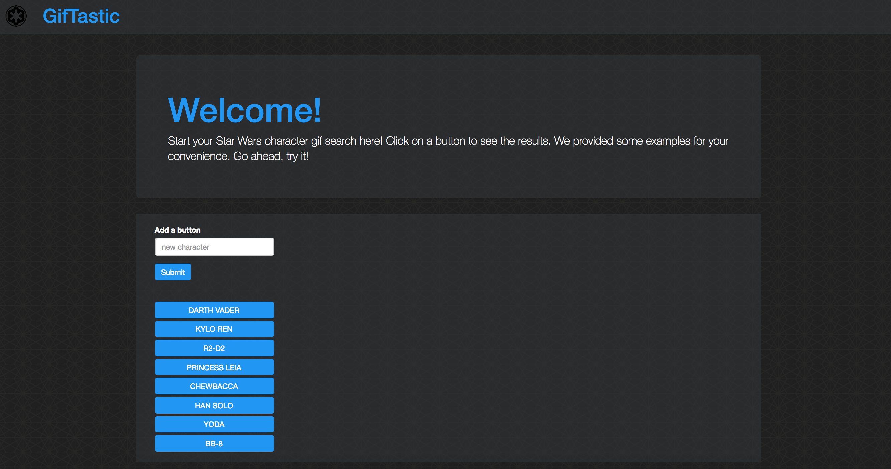
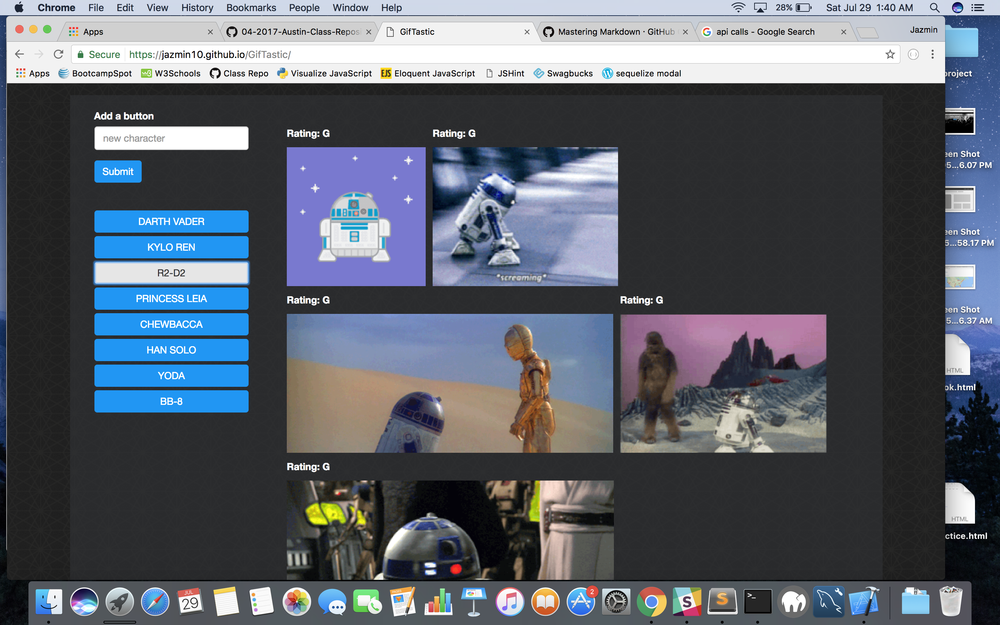
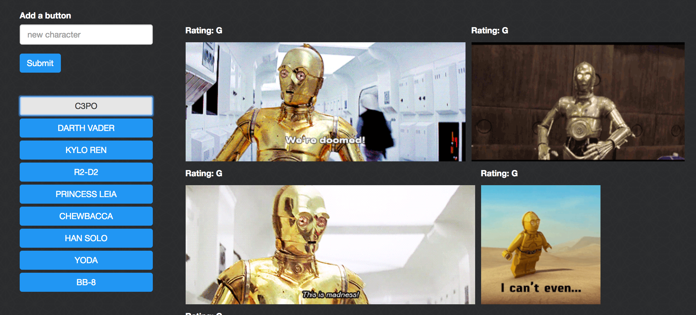

# Making API Calls with AJAX

### Overview

For this project, I used the GIPHY API to make a dynamic web page that populates Star Wars characters gifs. To finish this task, I made calls to the GIPHY API using AJAX and used JavaScript and jQuery to change the HTML of my site.

### Project Guidelines

These were guidelines I had to follow in order to complete the app.

    1. Before you can make any part of your site work, you need to create an array of strings, each one related to a topic that interests you. Save it to a variable called topics.
    2. Your app should take the topics in this array and create buttons in your HTML.
    3. When the user clicks on a button, the page should grab 10 static, non-animated gif images from the GIPHY API and place them on the page.
    4. When the user clicks one of the still GIPHY images, the gif should animate. If the user clicks the gif again, it should stop playing.
    5. Under every gif, display its rating (PG, G, so on).
    6. Add a form to your page takes the value from a user input box and adds it into your topics array. Then make a function call that takes each topic in the array remakes the buttons on the page.

### Project Screenshots

#### Landing page

#### Selecting a character

#### Adding a new button to the list

For this example, I added C3PO to the list. 

